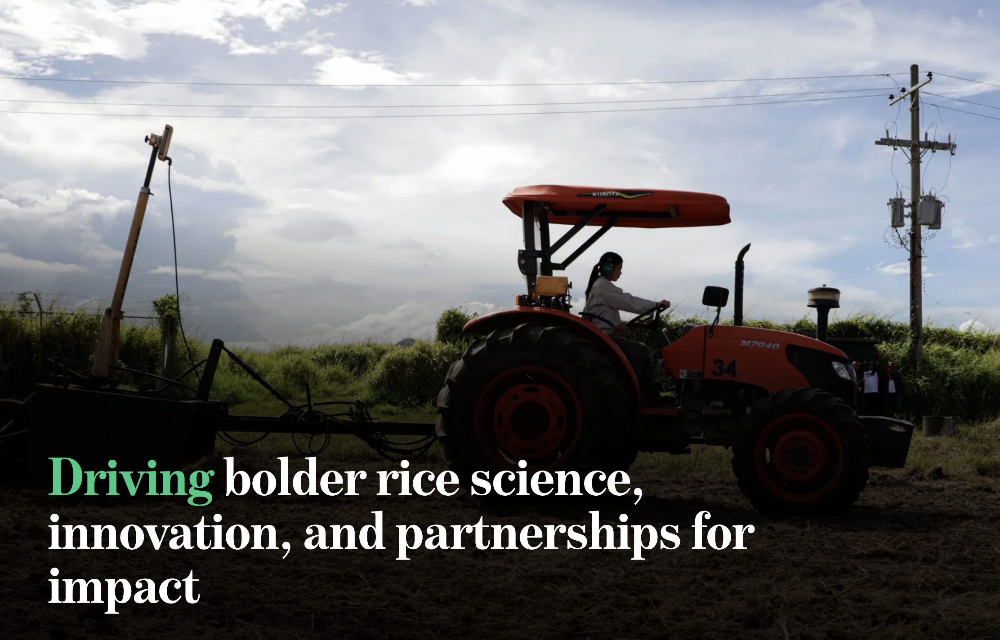
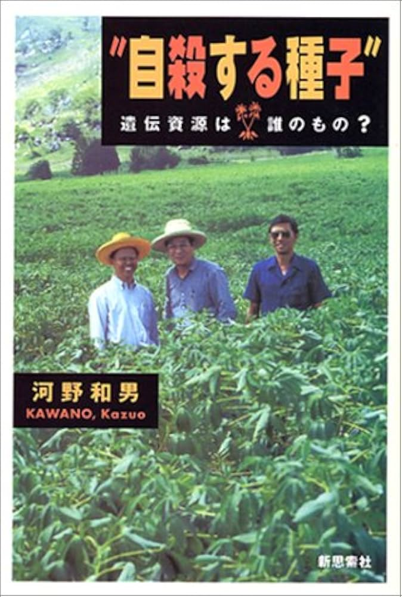
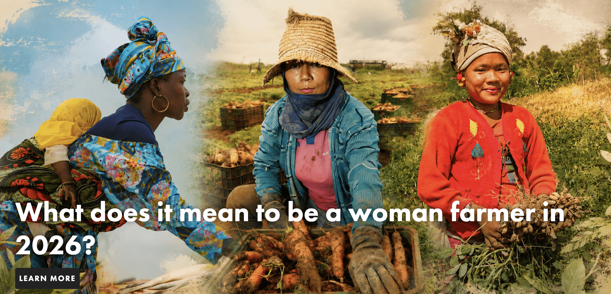
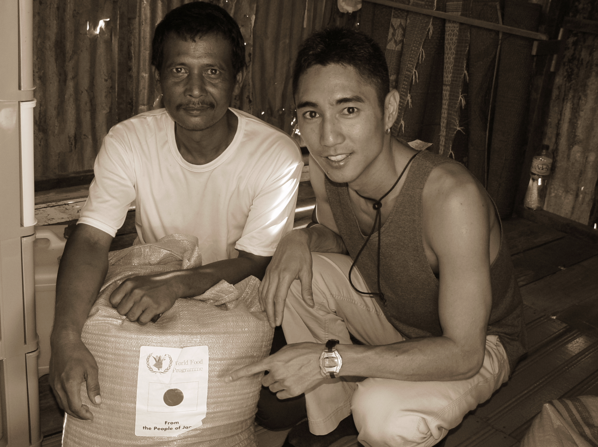
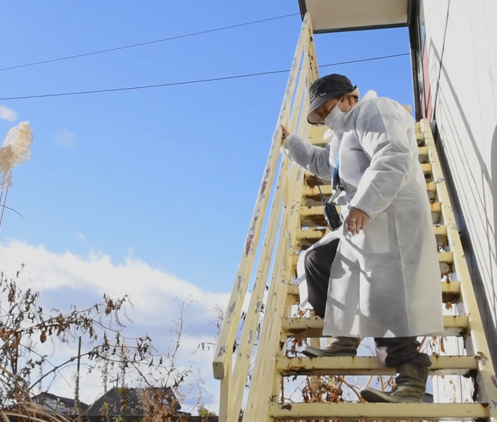

<!-- An image-only opening. These are prompts for Yoh, not words to display on screen.
     All five new images were supplied by Yoh for this lecture. The final still
     is from Yoh's existing Human Error slide in this course repository.
     Tell the memories in your own words; do not treat the institutional images
     as archival photographs of your father or the pictured farmers as his collaborators. -->

<!-- _class: logo -->

<!-- OPEN / Ask first, before telling the story: “Where does a global story begin?”
     Give each of the five students room to answer with a place or a person.
     Then: my father began his career as a PhD student at IRRI in the Philippines.
     He met my mother there. That meeting is part of why I am here. -->

---

<!-- The image is a present-day IRRI banner, not a photograph from my father's time.
     Speak about agricultural research as work that travels across borders but
     only matters through farmers and their lived conditions. Ask: who is missing
     from an image of scientific innovation? -->

---

<!-- Colombia. My father worked at CIAT and made cassava his life's research.
     My childhood as an urban nomad followed the geography of his work.
     The cover names him: 河野和男 / Kazuo Kawano. Explain what cassava meant to
     farmers, and tell the story of seeing my father work in a global sphere.
     Ask: when does research become a relationship? -->

---

<!-- This is an illustrative image of farmers, not the farmer in the memory.
     Tell the story of the photograph my father showed me: a farmer standing
     with his bicycle. He described the bicycle as a marker of status, and the
     farmer's gratitude for the material change in his life. Let the students
     examine what this memory reveals, and what it does not tell us about the
     farmer's own account. Ask: whose definition of impact do we listen to? -->

---

<!-- Fast-forward: my career begins at UCLA. The 2004 Indian Ocean tsunami
     takes me to Banda Aceh. Tell the encounter with the leader of an IDP camp,
     who thanked me simply for being Japanese because of a bag of rice from
     Japan. The WFP/Japan marking is visible in this photograph. Pause here.
     What does that moment say about identity, aid, and responsibility?
     Avoid assuming the identity of the other person in the photograph. -->

---

<!-- From Aceh I became a disaster ethnographer: perhaps not the conventional
     “global engineer,” but a global citizen intent on making unheard stories
     heard. Human Error is part of that work. Then turn the room over to the
     five students: What places, people, or events have shaped your trajectory?
     What story do you feel responsible for telling? Give each person time,
     and let these stories become the starting material of our studio. -->
