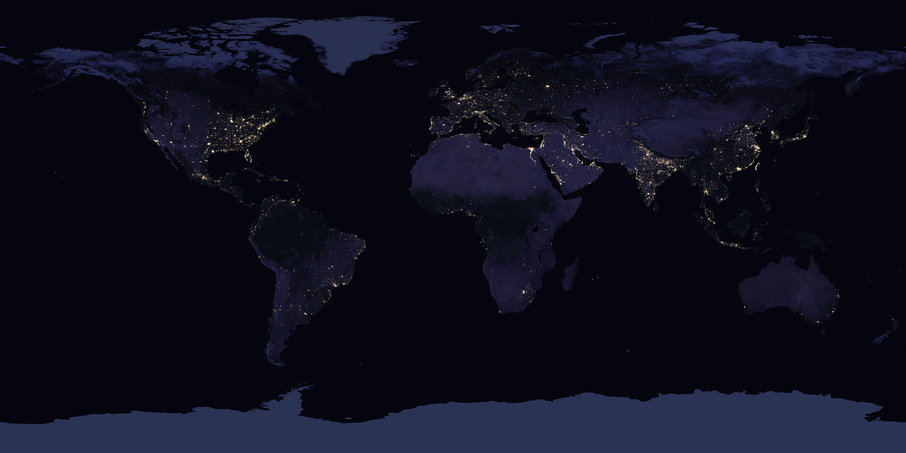
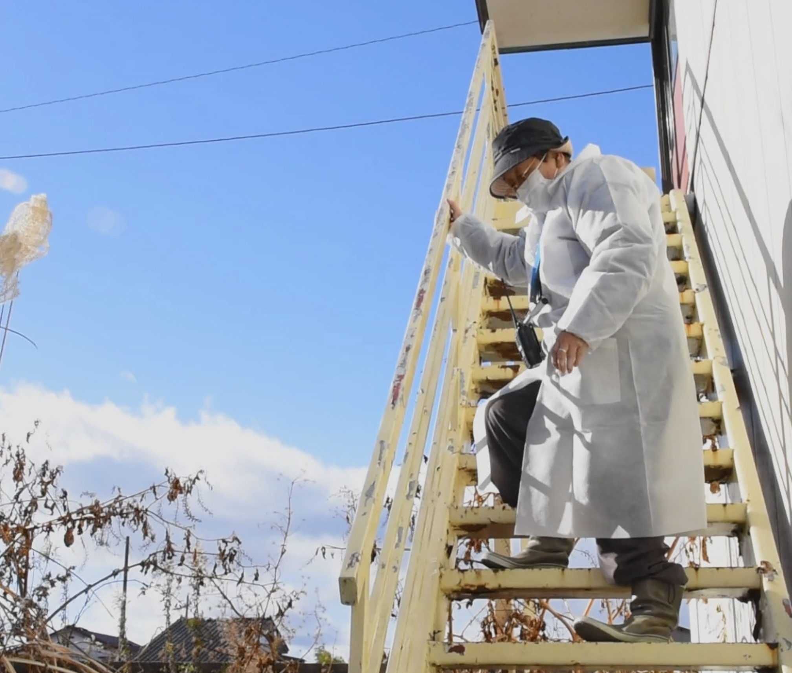

<!-- Adapted from the Marp Week 1 source in 26-2-Dataviz. -->

<!-- _class: night -->

NASA Earth Observatory · Suomi NPP VIIRS · 2016

<a href="https://worldview.earthdata.nasa.gov/?l=VIIRS_SNPP_DayNightBand_ENCC%28hidden%29%2CReference_Labels_15m%28hidden%29%2CReference_Features_15m%28hidden%29%2CCoastlines_15m%28hidden%29%2CVIIRS_Black_Marble%2CVIIRS_SNPP_CorrectedReflectance_TrueColor%28hidden%29&lg=false&t=2016-01-01-T00%3A00%3A00Z" target="_blank" rel="noopener">Explore the interactive night-lights map ↗</a>

<!-- Begin in silence for 20 seconds. Source: https://science.nasa.gov/earth/earth-observatory/earth-at-night/maps/ -->

---

<!-- _class: question -->
# What do you feel when you see this?

One word each. No explanation yet.

<!-- Five students: invite every voice. Write their five words where everyone can see them. -->

---

<!-- _class: night -->

<h1>Follow one light.</h1>
Where was its energy made? What does the light hide?

NASA Earth Observatory · <a href="https://science.nasa.gov/earth/earth-observatory/earth-at-night/maps/">image and method ↗</a>

<!-- Let students choose a place. The satellite measures illumination, not access, safety, or a community's experience. Ask what happened to light in eastern Japan in March 2011. -->

---

<!-- _class: visual -->
# Human Error: a life behind the energy system

<figure class="frame dark portrait"></figure>

What can a person tell us that an energy chart cannot?

<em>Human Error</em> · directed by Yoh · <a href="https://filmfreeway.com/HumanError">film and synopsis ↗</a> · <a href="https://yohman.github.io/yoh/">portfolio ↗</a>

<!-- Introduce the film before explaining reactor statistics. Screen a short excerpt if available; do not imply this still alone tells any individual's full story. Invite observations, not assumptions about the pictured person. -->

---

<!-- _class: question -->
# A disaster is not a single story.

Who had to leave? Who could return? Who got to decide what was safe?

<!-- The film's testimony is a way in. Listen before quantifying. Ask students what evidence a resident, an engineer, and a regulator might each trust. -->

---

<!-- _class: chartslide -->
# Then Japan’s nuclear power went to zero

  
FY2010

<b>25.1%</b>

  
FY2014

<b>0.0%</b>

  
FY2024

<b>9.4%</b>

  
Nuclear share of electricity generation · bar scale: 0–25.1%

What had to replace that electricity?

FY2010–14: <a href="https://www.enecho.meti.go.jp/category/electricity_and_gas/nuclear/001/edu/future_ene/2023/kengaku_kyusyu.html">METI electricity-mix history ↗</a> · FY2024: <a href="https://www.enecho.meti.go.jp/en/category/brochures/pdf/japan_energy_2025.pdf">METI Japan’s Energy 2025 ↗</a>

<!-- The entire Japanese nuclear fleet was offline throughout 2014, not permanently abandoned. The first post-regulation restarts came in 2015. Do not confuse share of electricity with share of total primary energy. Source for all offline: https://www.iaea.org/sites/default/files/ntr2015.pdf -->

---

<!-- _class: chartslide -->
# Public opinion changed, too

  
2011

<b>44%</b>

  
2012

<b>70%</b>

  
Japanese adults saying Japan should reduce reliance on nuclear energy · bar scale: 0–100%

Whose trust does an engineer have to earn?

Pew Research Center national surveys, <a href="https://www.pewresearch.org/global/2011/06/01/japanese-resilient-but-see-economic-challenges-ahead/">April 2011 ↗</a> and <a href="https://www.pewresearch.org/global/2012/06/05/japanese-wary-of-nuclear-energy/">March–April 2012 ↗</a>; n=700 adults in each survey.

<!-- The shift is 44 to 70 percent, not evidence that everyone opposed all nuclear power. Ask what can and cannot be inferred from these two survey snapshots. -->

---

<!-- _class: timeline -->
# Fukushima crossed borders as a decision

  
<strong>March 2011</strong>
Fukushima Daiichi accident.

  
<strong>June 2011</strong>
Germany decided to phase out nuclear generation.

  
<strong>April 2023</strong>
Germany’s last three reactors shut down.

Why did different countries make different choices?

<a href="https://www.bundesregierung.de/breg-de/service/newsletter-und-abos/bulletin/regierungserklaerung-von-bundeskanzlerin-dr-angela-merkel-793374">German government, Merkel’s 2011 statement ↗</a> · <a href="https://www.bundesregierung.de/breg-de/schwerpunkte/bezahlbare-und-saubere-energie-1581908">German government, 2023 shutdown ↗</a>

<!-- Merkel explicitly said Fukushima changed her view. This is one national policy response, not a claim that the whole world phased out nuclear energy. Others continued or expanded it. -->

---

<!-- _class: timeline -->
# Fukushima crossed borders as a safety question

  
<strong>Hazards</strong>
Could extreme natural events exceed the plant’s design?

  
<strong>Response</strong>
What happens when several protections fail at once?

  
<strong>Oversight</strong>
Can independent regulators and peer reviews detect blind spots?

What does “safe enough” mean across borders?

IAEA <a href="https://www.iaea.org/sites/default/files/actionplanns.pdf">Action Plan on Nuclear Safety (2011) ↗</a> · <a href="https://www.iaea.org/newscenter/news/ministers-declaration-envisions-strengthened-nuclear-safety-regime">Ministerial declaration ↗</a>

<!-- The IAEA plan has 12 action areas, including hazard assessments, peer reviews, emergency preparedness, and stronger regulatory frameworks. It is a programme to strengthen safety, not proof that risk was eliminated. -->

---

<!-- _class: chartslide -->
# The energy moved across another border

  
FY2010

<b>20.2%</b>

  
FY2014

<b>6.3%</b>

  
FY2024

<b>16.4%</b>

  
Japan’s primary-energy self-sufficiency · bar scale: 0–100%

So about 84% was not supplied domestically in FY2024. What does that mean?

METI, <a href="https://www.enecho.meti.go.jp/en/category/brochures/pdf/japan_energy_2025.pdf">Japan’s Energy 2025, FY2024 preliminary data ↗</a>. IEA convention counts nuclear generation as domestic energy, even though uranium can be imported.

<!-- This is the answer to Yoh’s “80%?”: 16.4% self-sufficiency means roughly 83.6% not supplied domestically under this definition. Do not state that 83.6% of electricity is imported; electricity is mostly generated in Japan using a mix of domestic and imported inputs. -->

---

<!-- _class: chartslide -->
# What comes from abroad?

  
Oil

<b>34.8%</b>

  
Coal

<b>24.4%</b>

  
LNG

<b>20.8%</b>

  
Share of Japan’s FY2024 primary energy supply · together: 80.0% fossil fuels

Which of these fuels crosses the sea to reach us?

METI, <a href="https://www.enecho.meti.go.jp/en/category/brochures/pdf/japan_energy_2025.pdf">Japan’s Energy 2025 ↗</a>. These are shares of primary energy supply, not import shares or electricity shares.

<!-- METI says Japan depends heavily on imported oil, coal, and LNG. Bring the opening night lights back: their fuel chain is not visible from orbit. -->

---

<!-- _class: number -->
# One fuel, one narrow passage

&gt;90%

of Japan’s crude oil imports came from the Middle East in 2024.

What changes when tankers cannot move through Hormuz?

METI, <a href="https://www.enecho.meti.go.jp/about/pamphlet/pdf/energy_in_japan2025.pdf">2025 energy pamphlet, fossil-fuel import origins (2024) ↗</a>

<!-- “Middle East” and “via Hormuz” are not identical quantities. Do not say all Middle Eastern oil crosses the strait. Ask students to locate the strait on a map, then identify what information this percentage still leaves out. -->

---

<!-- _class: timeline -->
# In 2026, a distant conflict reached Japan

  
<strong>March</strong>
Iran-region conflict disrupted oil tanker passage through Hormuz.

  
<strong>March</strong>
Japan announced releases from public and private oil reserves.

  
<strong>September</strong>
IEA and Japan still discussed resilience after the disruption.

How long can stored energy buy us time?

<a href="https://www.meti.go.jp/english/press/2026/0316_003.html">METI, 16 March 2026 decision ↗</a> · <a href="https://www.iea.org/news/executive-director-meets-with-prime-minister-takaichi-of-japan-on-energy-security-and-cooperation">IEA, 14 September 2026 ↗</a>

<!-- Date-stamped case study. Do not claim Hormuz is closed today; conditions changed during 2026. Explain stockpiles as a buffer, not a permanent source of supply. -->

---

<!-- _class: question -->
# What is a global engineer?

Someone who can trace a light from a person’s life to a power plant, a fuel route, a public decision, and a distant crisis—and listen at every stop.

<!-- Offer this as a provisional definition. Ask each student what it misses. It is not a recommendation for or against nuclear energy. -->

---

<!-- _class: studio -->
# Studio: draw the chain

Start with one night light in Japan. Draw the people, places, fuels, decisions, and risks that make it possible.

Mark one link you can measure—and one you would need to ask a person about.

<small>7 minutes alone · 10 minutes together · one unanswered question per student</small>

<!-- Five students: everyone shares. Encourage competing energy pathways, and consider safety, security, cost, climate, and consent without forcing a consensus. -->

---

<!-- _class: question -->
# What will you see differently tonight?

<!-- Return to the first night-lights image, then ask students to revisit their opening one-word response. -->
