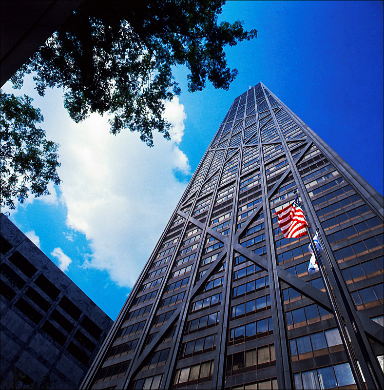
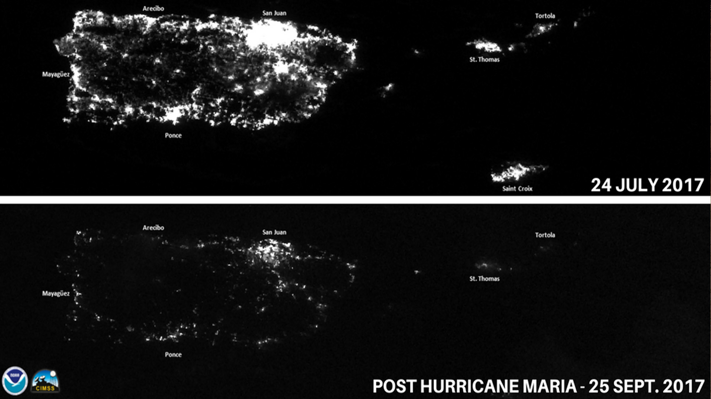
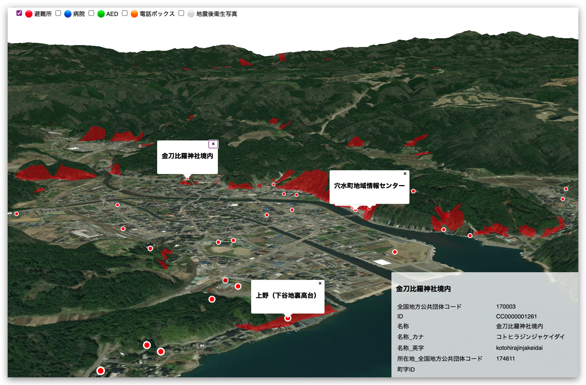
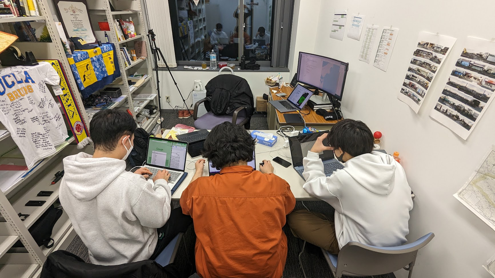
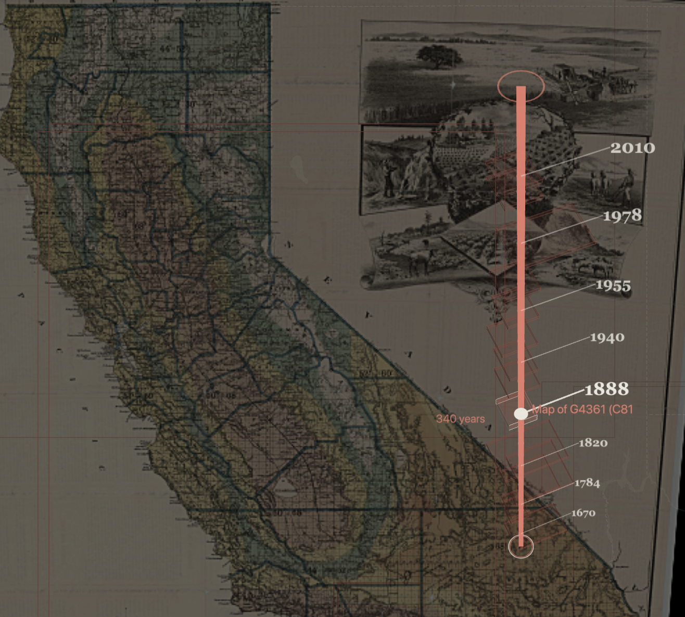
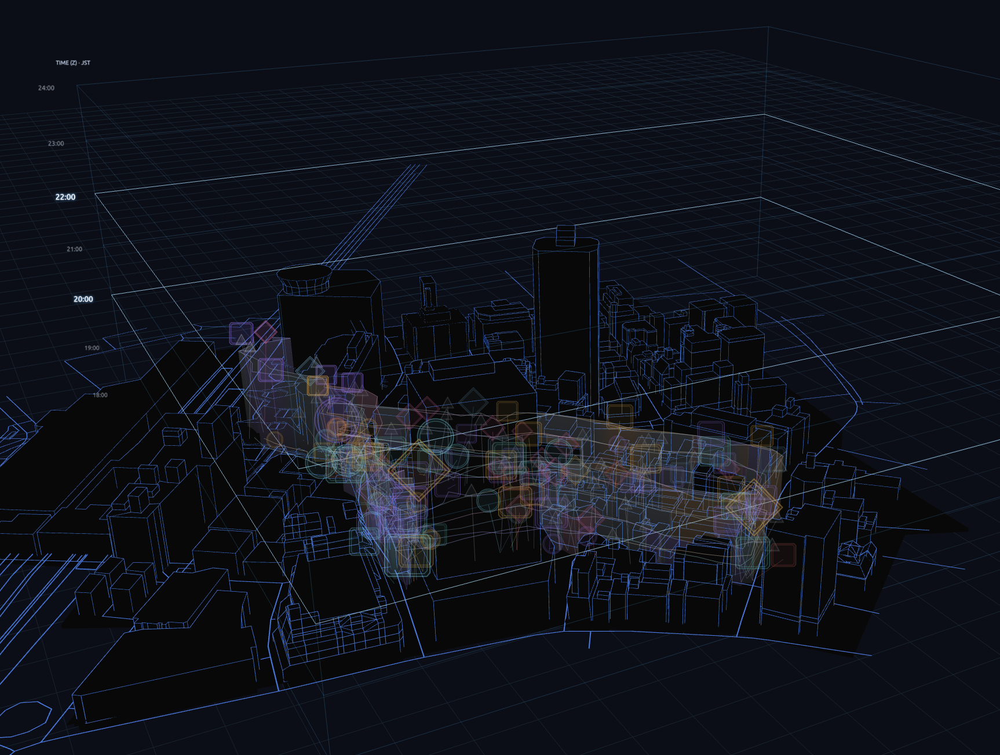
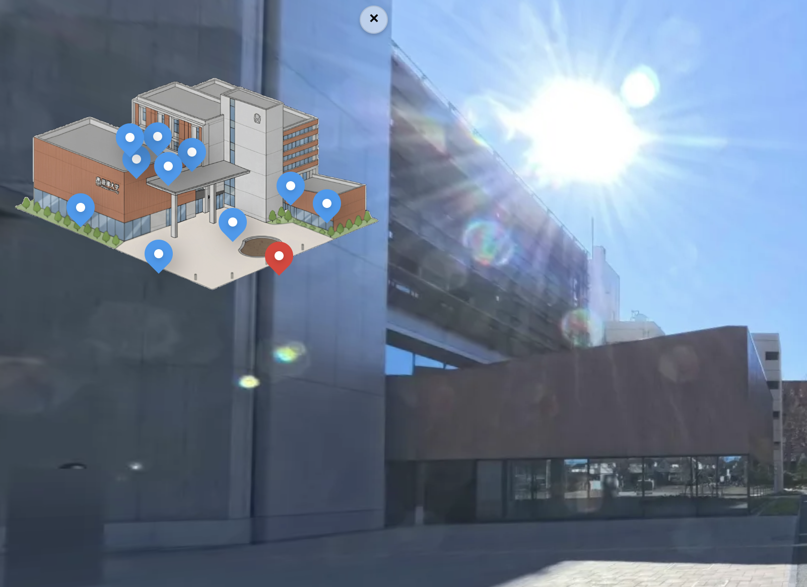

<!-- Adapted from the Marp Week 1 source in 26-2-Dataviz. -->

<!-- _class: night -->

NASA Earth Observatory · Suomi NPP VIIRS · 2016

<a href="https://worldview.earthdata.nasa.gov/?l=VIIRS_SNPP_DayNightBand_ENCC%28hidden%29%2CReference_Labels_15m%28hidden%29%2CReference_Features_15m%28hidden%29%2CCoastlines_15m%28hidden%29%2CVIIRS_Black_Marble%2CVIIRS_SNPP_CorrectedReflectance_TrueColor%28hidden%29%2CMODIS_Aqua_CorrectedReflectance_TrueColor%28hidden%29%2CMODIS_Terra_CorrectedReflectance_TrueColor&lg=false&t=2016-01-01-T00%3A00%3A00Z&tr=explore_the_earth_at_night" target="_blank" rel="noopener">Explore the interactive night-lights map ↗</a>

<!-- Show this without a title. Let everyone look in silence for 20 seconds. Source: https://science.nasa.gov/earth/earth-observatory/earth-at-night/maps/ -->

---

<!-- _class: question -->
# What do you feel when you see this?

One word each. No explanations yet.

<!-- Invite all five students in turn. Record their words without correcting them. -->

---

# What do you notice?

Where does your eye go first?

What pattern surprises you?

What is missing from this view?

<!-- Move from feeling to observation. Do not equate darkness with a lack of people, knowledge, or engineering. -->

---

# What the map measures

Satellite observations of light at night, combined into a global image from 2016.

It shows illumination. It cannot tell us, by itself, who benefits from a system or who bears its costs.

<!-- NASA describes a composite made from the best cloud-free nights for each land mass. Source: https://science.nasa.gov/earth/earth-observatory/earth-at-night/maps/ -->

---

# Follow one point of light

Who generated the electricity?

Who built and maintains the grid?

Who lives nearby but cannot use it?

<!-- Choose one place students named. Trace the chain aloud, then ask where the map stops helping. -->

---

<!-- _class: visual -->
# The routes beneath the sea

<figure class="frame"></figure>

When a cable fails, who notices first? Who can repair it?

2015 map: Greg Mahlknecht / OpenStreetMap contributors · <a href="https://commons.wikimedia.org/wiki/File:Submarine_cable_map_umap.png">image source ↗</a> · <a href="https://www.submarinecablemap.com/">explore the current interactive map ↗</a>

<!-- The image is a dated snapshot, not a current inventory. Open TeleGeography's live map to inspect landing points named by students. -->

---

<!-- _class: visual -->
# Fazlur Rahman Khan

<figure class="frame portrait"></figure>

How can one engineer’s structural idea travel beyond one city?

John Hancock Center, Chicago · engineer Fazlur Rahman Khan, architect Bruce Graham · photo: Nicolas G. Mertens · <a href="https://commons.wikimedia.org/wiki/File:Chicago,_IL%E2%80%94The_John_Hancock_(Fazlur_Khan_of_Skidmore,_Owings,_and_Merrill,_archs).jpg">photo source ↗</a> · <a href="https://ce.buet.ac.bd/dr-fazlur-rahman-khan/">Khan biography ↗</a>

<!-- The historical case asks how ideas move through collaborators, firms, materials, and cities. Khan's tubular systems helped transform tall-building design. -->

---

<!-- _class: visual -->
# A blackout seen from orbit

<figure class="frame"></figure>

What does this comparison reveal—and what can it not tell us?

NOAA / CIMSS · Puerto Rico, July and September 2017 · <a href="https://commons.wikimedia.org/wiki/File:Puerto_Rico_at_night_before_and_after_Hurricane_Maria.jpg">image and context ↗</a>

<!-- Ask what changed between dates before naming the hurricane; distinguish a satellite signal from a direct measure of human experience. -->

---

<!-- _class: visual -->
# A crisis map in the hands of students

<figure class="frame"></figure>

Which layer would you add first? Who would check it?

2024 Noto earthquake crisis map · Yoh and Reitaku University students · <a href="https://yohman.github.io/noto/">project log ↗</a> · <a href="https://yohman.github.io/noto/map.html">explore the historical map ↗</a>

<!-- The students assembled shelters, hospitals and capacity, and landslide-risk layers after the 2024 earthquake. This is a historical project, not current emergency guidance. Source: https://yohman.github.io/noto/ -->

---

<!-- _class: visual -->
# The map is a team effort

<figure class="frame photo"></figure>

What does each person need to know before a map goes public?

Reitaku University students working on the 2024 Noto crisis map · <a href="https://yohman.github.io/noto/">project and photo source ↗</a>

<!-- Talk about data finding, cleaning, geoprocessing, front-end design, and checking claims. The source identifies this as a Reitaku student project. -->

---

<!-- _class: visual -->
# Fukushima beyond the risk map

<figure class="frame portrait"></figure>

What can someone displaced tell us that a sensor cannot?

<em>Human Error</em> · documentary directed by Yoh about displacement after Fukushima · <a href="https://yohman.github.io/yoh/">portfolio and still ↗</a> · <a href="https://filmfreeway.com/HumanError">film page ↗</a>

<!-- Link this to Yoh's work mapping radiation and making Human Error. Do not imply the Noto and Fukushima disasters are the same event. Sources: https://www.linkedin.com/in/yohman/ and https://filmfreeway.com/HumanError -->

---

<!-- _class: visual -->
# A city has more than one history

<figure class="frame dark"></figure>

Whose memories does a map keep? Whose does it erase?

<em>HyperCities</em> · co-authored by Todd Presner, David Shepard, and Yoh · <a href="https://yohman.github.io/hypercities/">explore the redesign ↗</a> · <a href="https://yohman.github.io/yoh/about.html">Yoh’s bio ↗</a>

<!-- HyperCities treats maps as layered and polyvocal. The visual is from Yoh's portfolio, representing the redesign, while the 2014 book was co-authored. -->

---

<!-- _class: visual -->
# Kashiwa after dark

<figure class="frame dark"></figure>

What can students notice on the street that satellites miss?

Kashiwa After Dark · Yoh’s zemi collective project · <a href="https://kashiwa-after-dark.github.io/3DMAP_DataVisu/route-history/">explore the visualization ↗</a> · <a href="https://yohman.github.io/yoh/">portfolio ↗</a>

<!-- Return to the opening image: night lights show illuminated surfaces, while spatial ethnography asks how people inhabit the city at night. -->

---

<!-- _class: visual -->
# A campus made navigable

<figure class="frame"></figure>

Who might need this tool? How would we know it works for them?

Reitaku 360 · built by the 2025 second-year Yoh-zemi students · <a href="https://reitaku-campus.pages.dev/">explore the tour ↗</a> · <a href="https://yohman.github.io/yoh/">project context ↗</a>

<!-- The portfolio says the student project earned the 2025 Reitaku Engineering Faculty Award for Excellence in Student Work. Mention only if useful, and credit the team. -->

---

<!-- _class: question -->
# What is a global engineer?

Five students. Five first definitions.

<!-- Give each student one uninterrupted sentence. Put the definitions beside each other and look for differences. -->

---

# A working definition

A global engineer follows a system across places, listens to the people it affects, and makes its tradeoffs visible.

What would you change in that sentence?

<!-- Offer this as a draft for critique, not a final answer. Revisit it at the end of the semester. -->

---

<!-- _class: studio -->
# Studio: trace one campus system

Choose one system that reaches our campus: food, power, phones, transit, or water.

Sketch a place it connects to, a person it depends on, and a question the available data cannot answer.

<small>7 minutes alone · 10 minutes around the table · one question to carry forward</small>

<!-- With five students, everyone shares. Keep the sketches as the starting point for the Engineering Nation Atlas. -->

---

<!-- _class: question -->
# What will you look at differently tomorrow?

<!-- Close with one sentence from each student. Connect their questions to the Week 1 Atlas task on the agenda. -->
